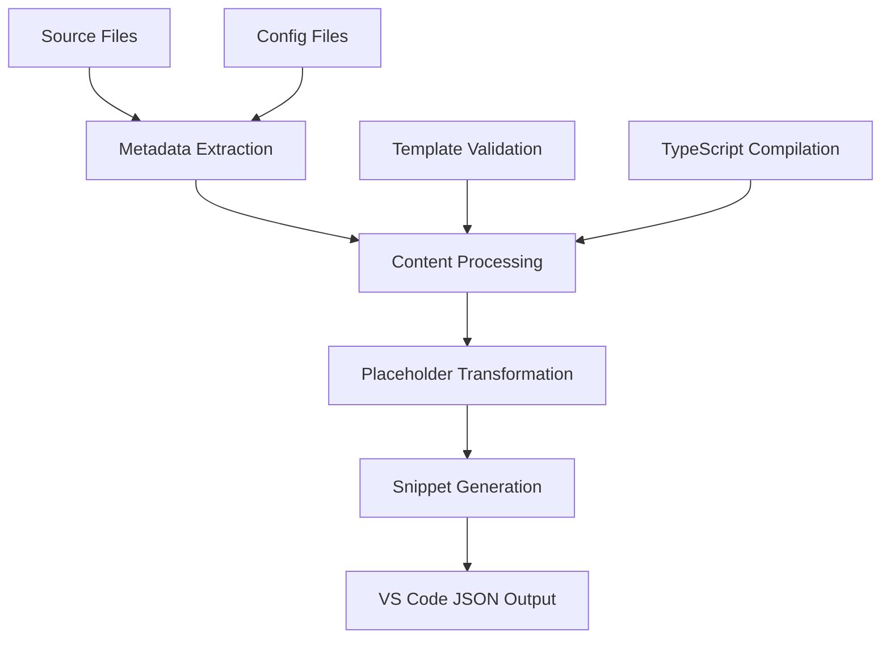

# Development Suggestions & Future Considerations

## 📋 Current State Assessment

### ✅ Recent Achievements
- **Library Consolidation**: Successfully unified fragmented directory structure into cohesive `library/` organization
- **Build System Enhancement**: Improved performance with parallel processing and unified path management
- **Code Quality**: ESLint integration with comprehensive styling and quality rules
- **Documentation**: Enhanced CHANGELOG with detailed architectural change documentation

### 🎯 Structural Improvements Completed
1. **Directory Consolidation**: `library-scripts/` + `library-snippets/` + `utilities/` → `library/`
2. **Logical Organization**: Clear separation between scripts, snippets, and utilities
3. **Import Path Consistency**: Unified import paths throughout codebase
4. **Legacy Cleanup**: Removed deprecated files and orphaned directory structures

## 🔍 Areas for Future Development

### 1. Build System Evolution

#### TypeScript Integration
- **Consideration**: Add TypeScript compilation pipeline for `library/snippets-vscode/` TypeScript files
- **Benefits**: Type checking, better IDE support, early error detection
- **Implementation**: 
  ```bash
  npm install --save-dev typescript @types/node
  # Add tsconfig.json for snippet compilation
  # Integrate TypeScript build into npm scripts
  ```

#### Build Performance Optimization
- **Current State**: Parallel file processing implemented
- **Future Enhancement**: Incremental builds with change detection
- **Consideration**: Implement file watching with selective rebuilding based on changed directories
- **Implementation**: Extend chokidar integration to track specific file changes

### 2. Development Experience Improvements

#### Testing Infrastructure
- **Gap**: No automated testing for modal system or utility functions
- **Priority**: Medium-High
- **Suggestion**: 
  ```bash
  npm install --save-dev jest @types/jest
  # Create test/ directory structure
  # Add unit tests for utilities and core functions
  # Integration tests for snippet generation
  ```

#### Code Quality Enhancements
- **Current**: ESLint with stylistic rules
- **Addition**: Prettier for consistent formatting
- **Consideration**: Pre-commit hooks for code quality enforcement
- **Implementation**:
  ```bash
  npm install --save-dev prettier husky lint-staged
  # Configure .prettierrc
  # Setup pre-commit hooks
  ```

### 3. Library Structure Refinements

#### Snippet Organization Enhancement
- **Current**: Basic language-based organization
- **Enhancement**: Feature-based sub-organization within languages
- **Structure Suggestion**:
  ```
  library/snippets-vscode/
  ├── javascript/
  │   ├── obsidian-api/
  │   │   ├── file-operations/
  │   │   ├── workspace-management/
  │   │   └── plugin-lifecycle/
  │   ├── codescript-toolkit/
  │   │   ├── invocables/
  │   │   ├── buttons/
  │   │   └── utilities/
  │   └── general-utils/
  ```

#### Documentation Automation
- **Gap**: Manual documentation maintenance
- **Enhancement**: Auto-generate snippet documentation from metadata
- **Implementation**: Extract snippet metadata during build process and generate reference docs

### 4. Integration Improvements

#### VS Code Workspace Enhancement
- **Current**: Basic workspace configuration
- **Enhancement**: 
  - Tailored settings for library development
  - Snippet testing workspace setup
  - Debug configurations for build scripts

#### GitHub Actions Integration
- **Consideration**: Automated testing and linting on PR creation
- **Benefits**: Ensure code quality before merge
- **Implementation**: Basic workflow for lint/test/build validation

### 5. Advanced Features

#### Template System Evolution
- **Current**: Basic modal-based template system
- **Evolution**: 
  - Template validation
  - Complex form field types
  - Template previews
  - Template inheritance/composition

#### Snippet Validation System
- **Need**: Validate snippet syntax and metadata before build
- **Features**:
  - Metadata completeness validation
  - Code syntax checking
  - Duplicate prefix detection
  - Integration with build process

## 🏗️ Architectural Considerations

### Build System Architecture


### Future Module System
- **Consideration**: Plugin-style architecture for extending build system
- **Benefits**: Easy addition of new snippet types or processing steps
- **Implementation**: Event-based processing pipeline with plugin hooks

## 📈 Priority Matrix

### High Priority (Next 2-4 weeks)
1. **Testing Infrastructure**: Unit tests for utilities and core functions
2. **Build Validation**: Ensure snippet generation produces valid VS Code snippets
3. **Documentation**: Auto-generate snippet reference from metadata

### Medium Priority (Next 1-2 months)
1. **TypeScript Integration**: Full TypeScript build pipeline
2. **Advanced Snippet Organization**: Feature-based organization
3. **Prettier Integration**: Consistent code formatting

### Low Priority (Future iterations)
1. **GitHub Actions**: CI/CD pipeline
2. **Template System Enhancement**: Advanced template features
3. **Plugin Architecture**: Extensible build system

## 🔧 Implementation Recommendations

### Incremental Development Approach
1. **Phase 1**: Testing and validation (current priority)
2. **Phase 2**: TypeScript integration and advanced organization
3. **Phase 3**: Automation and advanced features

### Development Workflow Suggestions
```bash
# Recommended development cycle
npm run dev              # Start file watching
npm run lint             # Code quality check
npm run test             # Run tests (when implemented)
npm run build:snippets   # Generate snippets
npm run validate         # Validate output (when implemented)
```

### Code Review Considerations
- Focus on import path consistency in library structure
- Validate metadata completeness in snippet files
- Ensure backwards compatibility with existing functionality
- Review build performance impact of changes

## 🎯 Success Metrics

### Code Quality Metrics
- ESLint error count: Target 0 errors
- Test coverage: Target >80% for utilities
- Build performance: Target <5s for full rebuild

### Developer Experience Metrics
- Setup time for new contributors: Target <10 minutes
- Documentation completeness: All snippets documented
- Build reliability: 100% success rate on valid input

## 📝 Notes for Future Sessions

### Context Preservation
- Library structure is now stabilized under `library/` directory
- Build system uses unified path management
- ESLint configuration is comprehensive and enforced
- CHANGELOG documentation is detailed and current

### Key Decisions Made
1. **Single Library Directory**: Consolidation improved maintainability
2. **Performance Over Simplicity**: Parallel processing worth the complexity
3. **Comprehensive Documentation**: Detailed CHANGELOG preferred over brief summaries

### Technical Debt
- Some legacy configuration files may need updating for new structure
- Import path validation could be automated
- Error handling in build system could be more robust

---

*This document should be updated as the library evolves and new considerations emerge.*